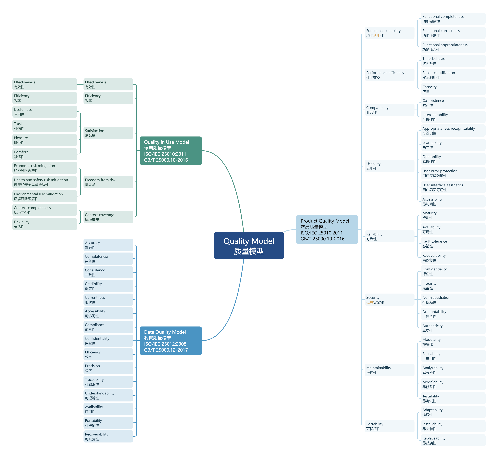

# 质量模型

    图：质量模型特性

    图：质量模型特性（新版）

## 产品质量模型

    图：ISO/IEC 25010:2011 Product Quality Model

    图：ISO/IEC 25010:2023 Product Quality Model

## 使用质量模型

    图：ISO/IEC 25010:2011 Quality in Use Model

## 数据质量模型

    图：ISO/IEC 25012:2008 Data Quality Model

## 参考

[1]. [ISO/IEC 25010:2011 Systems and software Quality Requirements and Evaluation (SQuaRE) - System and software quality models](https://www.iso.org/standard/35733.html)

[2]. [ISO/IEC 25010:2023 Systems and software Quality Requirements and Evaluation (SQuaRE) - Product quality model](https://www.iso.org/standard/78176.html)

[3]. [ISO/IEC 25019:2023 Systems and software Quality Requirements and Evaluation (SQuaRE) - Quality-in-use model](https://www.iso.org/standard/78177.html)

[4]. [ISO/IEC 25012:2008 Software product Quality Requirements and Evaluation (SQuaRE) - Data quality model](https://www.iso.org/standard/35736.html)

[5]. [GB/T 25000.10-2016 系统与软件工程 系统与软件质量要求和评价（SQuaRE） 第10部分：系统与软件质量模型](https://openstd.samr.gov.cn/bzgk/gb/newGbInfo?hcno=DB14B9415F3D51A9EF321EA62EDDE9A6)

[6]. [GB/T 25000.12-2017 系统与软件工程 系统与软件质量要求和评价（SQuaRE） 第12部分：数据质量模型](https://openstd.samr.gov.cn/bzgk/gb/newGbInfo?hcno=5F321C0658CFA120F5AA401A304DC08A)
